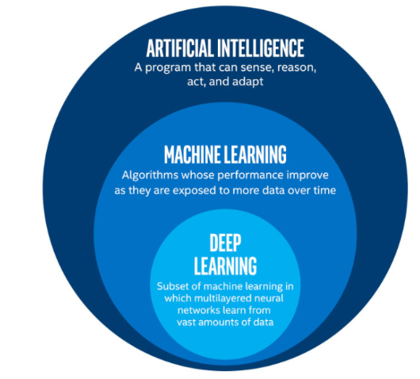
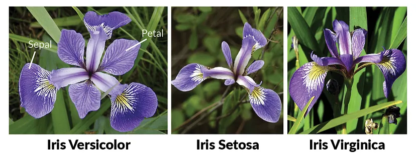
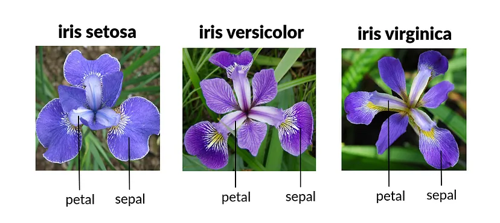
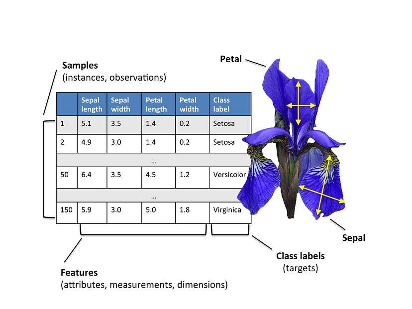
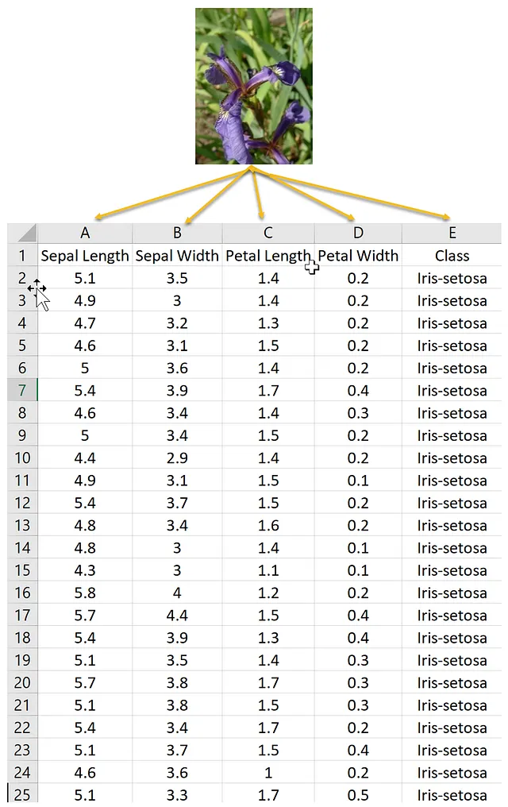

# สรุป Machine Learning

## Dataset (ชุดข้อมูล) ##
คือ การนำข้อมูลที่มีคุณสมบัติเหมือนกันมาจัดเป็นชุดให้ถูกต้องตามลักษณะโครงสร้างข้อมูล โดยชุดข้อมูลพื้นฐานที่ใช้กันอย่างแพร่หลายทางด้าน Machine Learning ได้แก่ชุดข้อมูลดอกไม้ (Iris Dataset) กับ ชุดข้อมูลลายมือตัวเลขอารบิก (MNSIT Dataset)

**1.ชุดข้อมูลดอกไม้ (Iris Dataset)** เป็นชุดข้อมูลพื้นฐานที่ใช้งานอย่างแพร่หลายในด้านสถิติและ Machine Learning โดยชุดข้อมูลดอกไม้ประกอบไปด้วยดอกไม้ 3 สายพันธุ์ได้แก่ Versicolor , Setosa , Virginica ดังภาพประกอบด้านล่าง

## คุณสมบัติหรือ Feature ในชุดข้อมูลดอกไม้ ##
คือการวัดความกว้างและความยาวของกลีบใบที่เรียกว่า Sepal และ Petal (มีหน่วยเป็นเซนติเมตร cm.)

## ตัวอย่างการเก็บชุดข้อมูลดอกไม้ ##

สรุป :

- Class Label / Target คือ ชื่อข้อมูลที่ต้องการทราบเป็นผลลัพธ์ (Output) เช่น ชื่อสายพันธุ์ดอกไม้ 3 ชนิด
- Attribute / Features คือ คุณสมบัติของดอกไม้แต่ละสายพันธุ์ (ความยาว ความสูงหน่วยเซนติเมตร)
 

